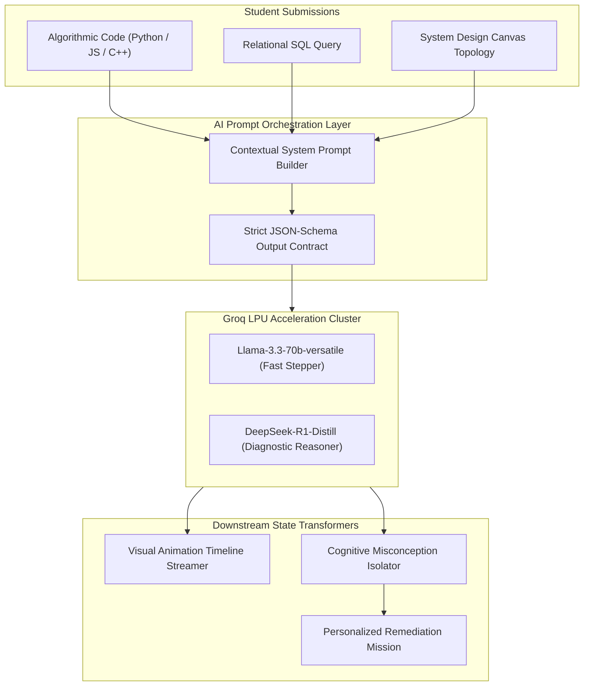

# CogniFlow AI: AI Engine & Groq Integration Blueprint

**Core AI Engine:** Groq Cloud LPU (Language Processing Unit)  
**Models Deployed:** `llama-3.3-70b-versatile` (Primary Visual Decomposition) & `deepseek-r1-distill-llama-70b` (Deep Diagnostic Reasoning)  
**Hackathon Alignment:** Lenovo LEAP AI Hackathon 2026 (AKTU Lucknow) — *Theme 1: AI in Education & Skilling (Problem Statement 1: Learning Gaps, Weakness Identification & Individualized Study Plans)*

---

## 1. Why Groq LPU for Educational Visualizers?

In interactive visual education, latency directly dictates the cognitive learning experience:
- **Traditional Cloud GPU Inference (8–15 seconds):** Causes severe student disengagement. When a student modifies a line in their Binary Search or SQL query, waiting 10 seconds breaks their cognitive flow.
- **Groq LPU Inference ($< 450\text{ ms}$ at $\approx 350\text{ tokens/sec}$):** Provides instantaneous, near-zero perceptible delay. As soon as the student hits "Run", Groq synthesizes the multi-step animation frames and diagnostic critique almost instantaneously.

---

## 2. AI Subsystems & Functional Architecture



---

## 3. Specialized AI Prompts & JSON Schema Contracts

### 3.1 Prompt 1: DSA Dynamic Visual Frame Synthesis
Converts user code and test input into an ordered, step-by-step animation sequence without executing unsafe code on the server.

#### System Prompt
```text
You are the CogniFlow AI Code-to-Animation Compiler.
Your task is to mentally execute the user's provided code against the given input step-by-step and output an ordered array of animation frames.
Rules:
1. Every major state transition (pointer movement, variable change, array element swap, comparison) must be a discrete frame.
2. Provide exact 1-indexed line numbers matching the user's code for synchronization.
3. Provide a clear, intuitive 1-sentence explanation of what occurs in that step for a student learner.
4. Output MUST STRICTLY be a valid JSON object matching the requested schema. No markdown outside the JSON.
```

#### JSON Output Schema
```json
{
  "totalSteps": 4,
  "frames": [
    {
      "step": 1,
      "lineNumber": 3,
      "action": "POINTER_INIT",
      "dataStructureState": {
        "type": "ARRAY",
        "values": [1, 3, 5, 7, 9],
        "pointers": [
          {"name": "low", "index": 0, "color": "#10B981"},
          {"name": "high", "index": 4, "color": "#EF4444"}
        ]
      },
      "explanation": "Pointers initialized: low at index 0 (val 1) and high at index 4 (val 9)."
    }
  ]
}
```

---

### 3.2 Prompt 2: Skill Gap Identification & Misconception Isolator
Directly addresses **Problem Statement 1 (Students struggle to identify their learning gaps and skills to improve)**. When a student's solution fails or is suboptimal, Groq isolates the precise conceptual root cause.

#### System Prompt
```text
You are an expert Computer Science Professor and Pedagogical Cognitive Diagnostician.
Analyze the student's submission against the benchmark problem and test cases.
Identify:
1. Did the student fail, achieve suboptimal time/space complexity, or miss boundary conditions?
2. What is the fundamental cognitive misconception (e.g., 'Off-by-One Loop Invariant', 'Recursion Base-Case Omission', 'Cartesian Explosion from Missing ON Clause', 'Single Point of Failure at Cache Tier')?
3. What is the severity score (1 to 100)?
4. Provide a personalized 3-step remediation action plan tailored to their exact mistake.
Output STRICT JSON.
```

#### JSON Output Schema
```json
{
  "hasLearningGap": true,
  "gapCategory": "Loop Invariant & Boundary Condition",
  "rootCauseAnalysis": "The while condition `low < high` terminates before inspecting when `low == high`, causing the search to miss the target when it resides at the final boundary element.",
  "conceptSeverityScore": 75,
  "remedyExplanation": "In binary search with inclusive bounds [low, high], the condition must be `low <= high` to guarantee the search space includes single-element intervals.",
  "individualizedStudyPlan": [
    {
      "stepOrder": 1,
      "action": "Visual Inspection",
      "recommendation": "Re-run the visualizer with single-element array [5] and target 5 to observe premature termination."
    },
    {
      "stepOrder": 2,
      "action": "Core Concept Remediation",
      "recommendation": "Review the 'Search Space Interval Contraction' micro-lesson in Track 1."
    },
    {
      "stepOrder": 3,
      "action": "Targeted Drill",
      "recommendation": "Solve Challenge #14: 'Find First and Last Position of Element in Sorted Array'."
    }
  ]
}
```

---

### 3.3 Prompt 3: SQL Relational Query Plan & Venn Visualizer
Simulates how a database engine (like PostgreSQL) executes the query, projecting tables and joins into visual relational animations.

#### System Prompt
```text
You are the CogniFlow AI Relational Query Execution Engine.
Given a SQL query and schema tables, trace how relational operators (SCAN, FILTER, JOIN, AGGREGATE) process the rows.
Output an ordered list of relational execution frames highlighting matched rows, dropped rows, and intermediate Cartesian products.
```

---

### 3.4 Prompt 4: Distributed System Design Chaos & Bottleneck Analyzer
Reviews user-constructed architecture diagrams (Clients $\to$ Load Balancers $\to$ Microservices $\to$ Databases) and evaluates high availability, throughput, and points of failure.

#### System Prompt
```text
You are a Principal Distributed Systems Architect.
Evaluate the user's system design canvas:
Nodes: [Client, Nginx_LB, User_Service, Orders_Service, Postgres_Primary]
Traffic: 50,000 requests per second.
Identify:
1. Single Points of Failure (SPOF)
2. Latency bottlenecks under peak load
3. Data consistency hazards (e.g. read-your-own-writes)
Suggest visual fixes (e.g., add Redis Cache, add Read Replica, introduce Kafka queue).
```

---

## 4. Adaptive Learning Radar & Dynamic Skill Score Formulation

CogniFlow AI updates the student's mastery vector $S = [s_1, s_2, \dots, s_n]$ in Supabase after every submission using an exponentially weighted moving average (EWMA):

$$S_{t} = \alpha \cdot M_{\text{sub}} + (1 - \alpha) \cdot S_{t-1}$$

Where:
- $S_t$: New mastery rating for that topic (0–100)
- $S_{t-1}$: Previous mastery rating
- $M_{\text{sub}}$: Score computed by Groq for the current submission (based on test correctness, time/space optimality, and code cleanliness)
- $\alpha$: Learning momentum factor ($0.35$)

This dynamic score feeds the real-time **Skill Radar Chart** visible on the student's dashboard and the aggregated **Cohort Weakness Heatmap** in the Admin Command Center.
