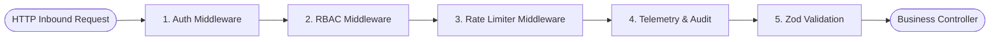

# CogniFlow AI: Developer & Platform Documentation

**Platform Version:** 1.0.0-Enterprise  
**Hackathon Target:** Lenovo LEAP AI Hackathon 2026 (AKTU Lucknow)  
**Theme:** AI in Education & Skilling — Problem Statement 1 (Learning Gaps, Weakness Identification & Individualized Study Plans)

---

## 1. Complete REST API Specifications

All endpoints are served from `/api/v1` and require standard JSON payloads with `Content-Type: application/json`.

### 1.1 Authentication & Profile APIs
| Method | Endpoint | Description | Auth Required | RBAC Role |
|---|---|---|---|---|
| `POST` | `/api/v1/auth/signup` | Register new student or mentor | No | Public |
| `POST` | `/api/v1/auth/login` | Authenticate and issue JWT | No | Public |
| `GET` | `/api/v1/users/me` | Fetch active user profile, streak & radar stats | Yes | `student`, `mentor`, `admin` |
| `PUT` | `/api/v1/users/me/preferences` | Update regional language or UI visual theme | Yes | `student` |

#### `GET /api/v1/users/me` Response Example
```json
{
  "status": "success",
  "data": {
    "id": "usr_c3409a88",
    "email": "priya.verma@ietlucknow.ac.in",
    "role": "student",
    "profile": {
      "fullName": "Priya Verma",
      "username": "priya_codes",
      "collegeName": "Institute of Engineering & Technology (IET) Lucknow",
      "avatarUrl": "https://images.unsplash.com/photo-1534528741775-53994a69daeb",
      "totalXp": 1420,
      "currentStreak": 12,
      "skillRadar": {
        "dsaPointers": 85,
        "recursionAndTrees": 62,
        "dynamicProgramming": 40,
        "sqlQueryOptimization": 78,
        "distributedSystemDesign": 55
      }
    }
  }
}
```

---

### 1.2 Curriculum & Visual Tracks API (100% Dynamic - No Hardcoded Data)
| Method | Endpoint | Description | Auth Required |
|---|---|---|---|
| `GET` | `/api/v1/tracks` | Fetch all published tracks (DSA, SQL, System Design) | Yes |
| `GET` | `/api/v1/tracks/:slug` | Fetch specific track with all modules and challenges | Yes |
| `GET` | `/api/v1/challenges/:id` | Fetch challenge definition, initial visual state & starter code | Yes |

#### `GET /api/v1/challenges/:id` Response Schema
```json
{
  "status": "success",
  "data": {
    "id": "ch_two_pointers_dsa_01",
    "title": "Two Sum II - Input Array Is Sorted",
    "slug": "two-sum-sorted",
    "challengeType": "dsa_algo",
    "problemStatement": "Given a 1-indexed array of integers numbers that is already sorted in non-decreasing order...",
    "initialVisualState": {
      "dataStructure": "ARRAY",
      "elements": [2, 7, 11, 15],
      "pointers": [
        {"name": "left", "index": 0, "color": "#10B981"},
        {"name": "right", "index": 3, "color": "#6366F1"}
      ],
      "target": 9
    },
    "starterCode": {
      "python": "def twoSum(numbers: list[int], target: int) -> list[int]:\n    # Implement with two pointers\n    pass",
      "javascript": "function twoSum(numbers, target) {\n    // Implement with two pointers\n}"
    },
    "testCases": [
      {"input": {"numbers": [2, 7, 11, 15], "target": 9}, "expected": [1, 2]}
    ],
    "xpReward": 50
  }
}
```

---

### 1.3 Submissions, Visual Step Generator & AI Diagnostic API
| Method | Endpoint | Description | Auth Required |
|---|---|---|---|
| `POST` | `/api/v1/submissions/run` | Execute code, generate visual frames & detect skill gaps | Yes |
| `GET` | `/api/v1/submissions/:id` | Fetch past visual execution frames for replay | Yes |

#### `POST /api/v1/submissions/run` Request Payload
```json
{
  "challengeId": "ch_two_pointers_dsa_01",
  "language": "python",
  "code": "def twoSum(numbers, target):\n    l = 0\n    r = len(numbers) - 1\n    while l < r:\n        s = numbers[l] + numbers[r]\n        if s == target: return [l+1, r+1]\n        elif s < target: l += 1\n        else: r -= 1\n    return []"
}
```

#### `POST /api/v1/submissions/run` Response Payload (Visual Animation Frames + Skill Gap Analysis)
```json
{
  "status": "success",
  "data": {
    "submissionId": "sub_8849102",
    "evaluation": "passed",
    "executionTimeMs": 18,
    "visualFrames": [
      {
        "step": 1,
        "line": 2,
        "action": "POINTER_INIT",
        "pointers": {"left": 0, "right": 3},
        "highlightedElements": [0, 3],
        "explanation": "Pointers initialized: left pointer at index 0 (val 2), right pointer at index 3 (val 15)."
      },
      {
        "step": 2,
        "line": 6,
        "action": "SUM_CALCULATION",
        "currentSum": 17,
        "target": 9,
        "explanation": "Calculated sum = 2 + 15 = 17. Since 17 > 9, we decrement right pointer."
      },
      {
        "step": 3,
        "line": 9,
        "action": "POINTER_MOVE",
        "pointers": {"left": 0, "right": 2},
        "highlightedElements": [0, 2],
        "explanation": "Right pointer moved to index 2 (val 11)."
      }
    ],
    "skillGapAssessment": {
      "hasGap": false,
      "masteryGained": "Two Pointers Array Shrinking Pattern",
      "conceptMasteryScore": 92,
      "feedback": "Flawless solution! Optimal O(n) time and O(1) auxiliary space achieved."
    }
  }
}
```

---

### 1.4 Admin Management APIs
| Method | Endpoint | Description | Auth Required | RBAC Role |
|---|---|---|---|---|
| `GET` | `/api/v1/admin/dashboard/metrics` | Real-time student join count, active sessions & drop-offs | Yes | `admin` |
| `GET` | `/api/v1/admin/analytics/skill-gaps` | Heatmap of top misconceptions across AKTU student batches | Yes | `admin` |
| `POST` | `/api/v1/admin/curriculum/challenges` | Create new challenge with visual initial state | Yes | `admin` |
| `GET` | `/api/v1/admin/telemetry/groq` | Groq token consumption, response latencies & cache hits | Yes | `admin` |

---

## 2. Middleware Architecture & Pipeline Specification

CogniFlow AI enforces enterprise security, strict type contracts, and upstream AI rate limits through an interconnected pipeline of five middlewares:



### 2.1 `authMiddleware.ts`
- **Purpose:** Cryptographically verifies incoming Bearer JWT tokens issued by Supabase Auth.
- **Header:** `Authorization: Bearer <supabase_jwt>`
- **Fail Response:** `401 Unauthorized` (`{ "error": "Invalid or expired session token" }`).
- **Context Injection:** Injects `req.user = { id, email, role }` into the request lifecycle.

### 2.2 `rbacMiddleware.ts`
- **Purpose:** Enforces Least Privilege Access Control across three discrete tiers: `student`, `mentor`, and `admin`.
- **Usage:** `router.post('/admin/*', rbacMiddleware(['admin']), ...)`
- **Fail Response:** `403 Forbidden` (`{ "error": "Insufficient privileges for administrative operation" }`).

### 2.3 `rateLimitMiddleware.ts`
- **Purpose:** Protects the Groq Cloud API from quota exhaustion, malicious brute-force scripts, and denial-of-wallet attacks.
- **Algorithm:** In-Memory Token Bucket with sliding-window decay.
- **Configuration:**
  - Standard endpoints: 100 requests / 60 seconds per IP.
  - AI Code Diagnosis endpoint: 15 submissions / 5 minutes per User ID.
- **Headers Exposed:** `X-RateLimit-Limit`, `X-RateLimit-Remaining`, `X-RateLimit-Reset`.
- **Fail Response:** `429 Too Many Requests`.

### 2.4 `auditMiddleware.ts`
- **Purpose:** End-to-end request tracing and observability for security audits and performance profiling.
- **Attributes Tracked:** Generates a unique `X-Trace-Id` UUID, records timestamp, method, path, status code, and latency in milliseconds.
- **Telemetry Pipe:** Asynchronously flushes slow queries ($> 1000\text{ ms}$) and unhandled 5xx errors to the Supabase telemetry audit log.

### 2.5 `validationMiddleware.ts`
- **Purpose:** Type-safe runtime schema enforcement using Zod.
- **Fail Response:** `422 Unprocessable Entity` with a detailed breakdown of field-level errors:
```json
{
  "error": "Validation Failed",
  "details": [
    {"field": "language", "message": "Expected 'python' | 'javascript' | 'sql'"}
  ]
}
```

---

## 3. Student User Manual

### 3.1 Navigating Visualizer Tracks
1. **Explore Tracks:** Choose between **Data Structures & Algorithms (DSA)**, **SQL Database Lab**, or **Distributed System Design**.
2. **Interactive Stepper:**
   - Click **Run & Visualize** to compile your solution.
   - Use the **Play ($\blacktriangleright$)**, **Pause ($\mathbf{\parallel}$)**, **Next Step ($\blacktriangleright\mid$)**, and **Previous Step ($\mid\blacktriangleleft$)** buttons.
   - Adjust the playback speed slider from `0.25x` (slow motion inspection) to `4.0x` (fast execution).
3. **Variable & Memory Inspector:** Observe stack frames, pointer registers, and dynamic heap node references in real time.
4. **Skill Gap Card:** If your solution has suboptimal time complexity or fails an edge case, inspect the AI Diagnostic Card below the editor to view the specific misconception detected and recommended remediation steps.

---

## 4. Admin Command Center Manual

### 4.1 Real-Time Join & Progress Monitor
- **Active Learners Pill:** Displays live student sessions connected across the state of Uttar Pradesh.
- **Live Event Stream:** Watch real-time submissions as they happen, color-coded by test status.
- **Curriculum CMS:** Add or edit problem statements, starter codes, and test cases directly through the web console without touching application code.

### 4.2 Cohort Skill Gap Heatmap
- Visualizes aggregated student failure patterns across AKTU engineering colleges.
- Identifies critical syllabus bottlenecks (e.g., 68% of 2nd-year students fail on Graph BFS visited sets; 54% fail on SQL correlated subqueries).
- Export diagnostic reports for university faculties.
