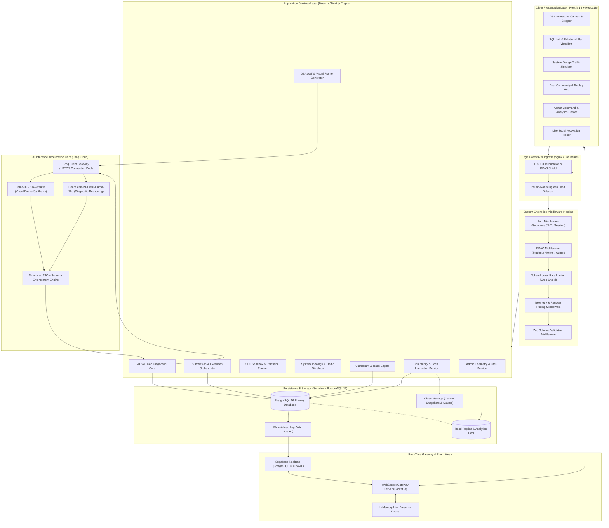
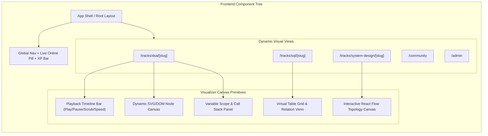
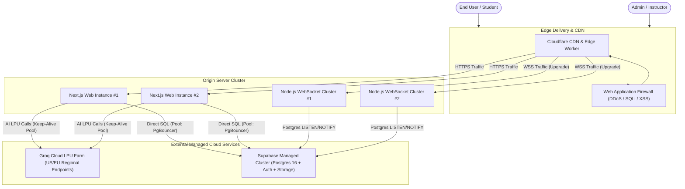
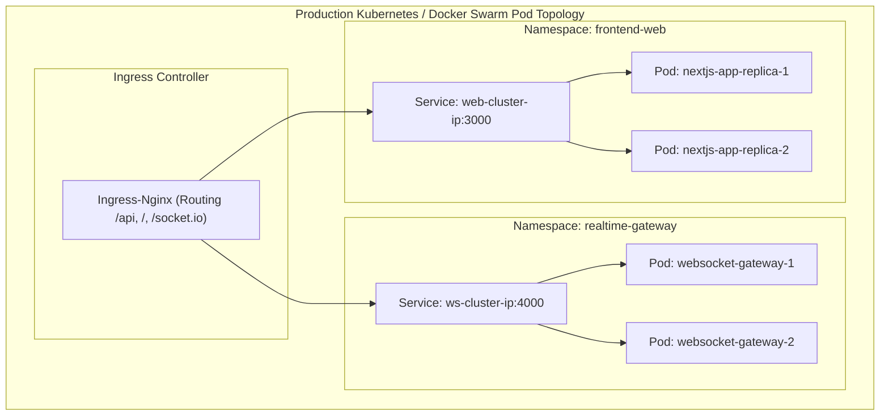

# CogniFlow AI: Project Architecture Blueprint

**Project Title:** CogniFlow AI — Real-Time Visual Education & Adaptive Skill Gap Web Platform  
**Hackathon Target:** Lenovo LEAP AI Hackathon 2026 (AKTU Lucknow)  
**Theme:** AI in Education & Skilling — Problem Statement 1 (Learning Gaps, Weakness Identification & Individualized Study Plans)  
**Benchmark Archetypes:** Masterji Platform Tour ([YouTube: I4HEpowCM20](https://youtu.be/I4HEpowCM20)), Chai SQLab ([YouTube: MhLycECL_Ec](https://youtu.be/MhLycECL_Ec)), ChaiCode DSA Visualizer ([dsa.chaicode.com](https://dsa.chaicode.com))

---

## 1. Executive Structural Overview

CogniFlow AI solves the crisis of abstract computing education by establishing a unified, multi-tier reactive architecture. Rather than static video lectures or isolated algorithmic text, the system couples **Abstract Syntax Tree (AST) parsing** with **Groq ultra-low-latency LPU AI models** to project executable code, SQL queries, and distributed network architectures into synchronized, frame-by-frame visual animations.

All curriculum modules, visual frames, user progressions, live presence indicators, and community interactions are dynamically persisted in **Supabase PostgreSQL** and broadcast through an event-driven **WebSocket & CDC Gateway**.

---

## 2. High-Level Enterprise Architecture

The following structural diagram illustrates the multi-tier separation between the Client Presentation Layer, Edge Gateway & Middlewares, Core Application Microservices, Real-Time Ingestion Engine, AI Inference Core, and the Persistence Layer.

---

## 3. Component Hierarchy & Module Topology

---

## 4. Network Topology & Traffic Routing

---

## 5. Security & Isolation Boundaries

| Boundary Layer | Threat Vector | Mitigation Strategy | Enforcement Mechanism |
|---|---|---|---|
| **Client Layer** | XSS, CSRF, Token Theft | HttpOnly SameSite=Strict cookies, CSP (Content Security Policy), sanitized DOM outputs | Next.js Security Headers |
| **API Ingress** | Credential stuffing, brute force, DDoS | IP-based rate limiting (100 req/min), Cloudflare Under Attack mode | Edge Nginx / Cloudflare |
| **AI Ingestion (Groq)**| Token exhaustion, prompt injection | Token-bucket rate limiter per user ID (15 AI requests / 5 mins), system prompt delimiter wrapping | `rateLimitMiddleware.ts` |
| **Database Access** | SQL Injection, Unauthorized row read/write | Supabase Row Level Security (RLS) policies, parameterized queries via Prisma / Drizzle | Supabase Auth + Postgres RLS |
| **Administrative Actions**| Privilege escalation | Double-checked RBAC middleware verifying cryptographic role claim `role = 'admin'` from verified JWT | `rbacMiddleware.ts` |
| **Code Execution** | Remote Code Execution (RCE) via user scripts | Client-side WASM execution sandbox + AST symbolic execution without host OS shell access | WebAssembly Sandbox |

---

## 6. Deployment & Container Topology

