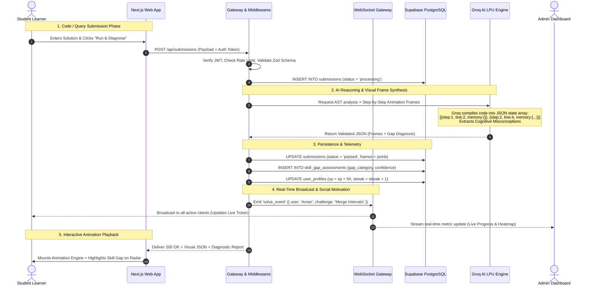
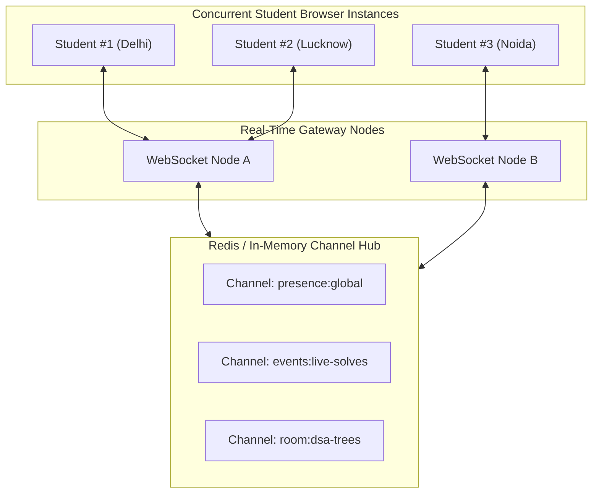
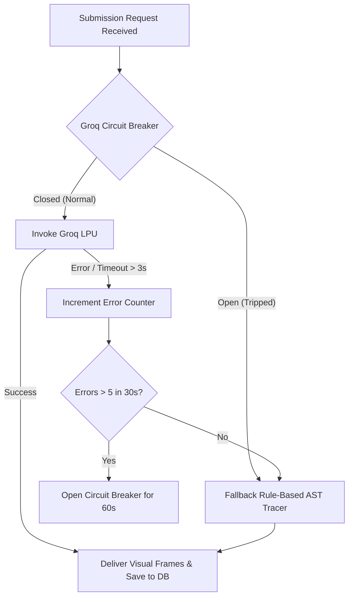
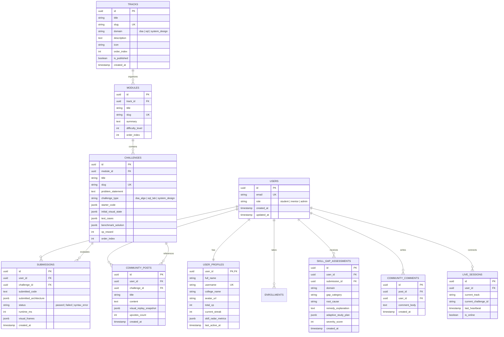

# CogniFlow AI: Comprehensive System Design Document

**System Name:** CogniFlow AI Distributed Visual Education Engine  
**Audience:** System Architects, Staff Engineers, Hackathon Evaluation Jury (Lenovo LEAP AI Hackathon 2026)  
**Core Problem Solved:** Dynamic, zero-hardcoded computer science visual education with real-time peer synchronization and sub-second AI learning gap detection.

---

## 1. System Requirements & Design Goals

### 1.1 Functional Requirements
1. **Unified Visualizer Pipeline:** Ingest arbitrary code, SQL statements, and distributed system canvas nodes, converting them dynamically into discrete, scrubbable animation state frames.
2. **AI Skill Gap Diagnostics:** On every submission or test run, automatically isolate fundamental misconceptions (e.g., recursion boundary errors, index scanning deficits, network bottlenecks) and update the student's mastery radar.
3. **Zero Hardcoded Content:** 100% of tracks, modules, challenges, visual metadata, and starter templates must be fetched dynamically from Supabase PostgreSQL.
4. **Real-Time Peer Pulse & Presence:** Stream live student counters, recent solution milestones, and active room peer bubbles via bi-directional WebSockets and Supabase Realtime CDC.
5. **Role-Based Admin Command Center:** Real-time visibility into student join velocity, learning gap frequency heatmaps, challenge authoring CMS, and Groq token telemetry.
6. **Community Collaboration:** Forkable visual execution traces, solution replays, threaded discussions, and upvoting.

### 1.2 Non-Functional Requirements & Quantitative SLOs
| Metric | Target Objective | Strategy |
|---|---|---|
| **Visual Step Generation Latency** | $\le 600\text{ ms}$ | Groq LPU LPUs with Llama-3.3-70B streaming + structured JSON output |
| **WebSocket Event Fan-out** | $\le 50\text{ ms}$ | Node.js lightweight event loop with in-memory presence maps |
| **Database Read Latency (p95)** | $\le 15\text{ ms}$ | Supabase PostgreSQL with PgBouncer connection pooling and indexed queries |
| **System Availability** | $99.95\%$ uptime | Stateless Next.js worker pods, horizontal WebSocket nodes, managed DB |
| **Animation Smoothness** | 60 FPS | Hardware-accelerated CSS transforms, requestAnimationFrame, and SVG layouts |

---

## 2. Distributed System Architecture & Data Flow



---

## 3. Real-Time WebSocket Protocol & State Synchronization

The WebSocket subsystem operates on top of Socket.io and native WebSockets to handle real-time student presence, live solves, and peer study room synchronization.



### 3.1 WebSocket Event Schema Dictionary

#### Event: `presence:join`
```json
{
  "event": "presence:join",
  "userId": "usr_998124",
  "username": "VikramDev",
  "track": "dsa-algorithms",
  "challengeId": "ch_binary_search",
  "timestamp": "2026-09-11T05:58:00Z"
}
```

#### Event: `ticker:live_solve`
```json
{
  "event": "ticker:live_solve",
  "userId": "usr_772109",
  "username": "Ananya Sharma",
  "college": "IET Lucknow",
  "challengeTitle": "Invert Binary Tree",
  "xpEarned": 50,
  "executionTime": "4ms",
  "timestamp": "2026-09-11T05:58:12Z"
}
```

#### Event: `admin:live_metric_stream`
```json
{
  "event": "admin:live_metric_stream",
  "activeLearners": 438,
  "solvesLastMinute": 24,
  "topStrugglingTopic": "Graph Cycle Detection (BFS/DFS)",
  "groqP99LatencyMs": 380
}
```

---

## 4. Multi-Tier Caching & Performance Strategy

```mermaid
flowchart LR
    Request([Client Request]) --> L1_Browser[L1: Browser SWR / Zustand Cache]
    L1_Browser -- Cache Miss --> L2_Edge[L2: Cloudflare Edge Cache (Static Tracks)]
    L2_Edge -- Cache Miss --> L3_Memory[L3: Redis / In-Memory Server LRU]
    L3_Memory -- Cache Miss --> L4_DB[(L4: Supabase PostgreSQL Primary)]

    L4_DB -. Write Invalidation .-> L3_Memory
    L3_Memory -. Stale While Revalidate .-> L2_Edge
```

1. **L1 (Client-Side SWR / Zustand):** Active visual frame sequences are cached in browser memory to ensure stutter-free stepping backward and forward without network roundtrips.
2. **L2 (Edge Cache):** Published curriculum tracks, challenge markdown definitions, and schema metadata are cached with `Cache-Control: public, s-maxage=3600, stale-while-revalidate=86400`.
3. **L3 (Server-Side Memory LRU):** Common AI visual frame outputs for identical test cases are hashed (`SHA-256(challengeId + codeHash)`) to bypass Groq calls on duplicate submissions, saving API credits.
4. **L4 (PostgreSQL Connection Pooling):** Supabase PgBouncer pool keeps up to 500 parallel serverless connections alive.

---

## 5. High Availability, Fault Tolerance & Resiliency



- **Resilience Design Pattern:**
  - **Circuit Breaker:** Protects against upstream AI outages. If Groq API throws 5 consecutive timeouts, the system gracefully falls back to deterministic AST static stepping.
  - **Dead Letter Queue (DLQ):** Failed telemetry and audit events are pushed to an asynchronous retry table rather than blocking user requests.
  - **Supabase Auto-Reconnection:** Client WebSocket listeners implement exponential backoff ($1\text{s}, 2\text{s}, 4\text{s}, \dots, 30\text{s}$) with jitter.

---

## 6. Comprehensive Database Schema & Entity-Relationship (ER) Model


